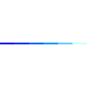

  

- 🔭 I’m currently a **CSE student at PTUK**
- 👩‍💻 I’m  a Programming Course Trainer, UI/UX Designer & Problem Solver 
- 💬 Ask me about Problem Solving ...
- 📫 How to reach me: layanabumousa1@gmail.com 
- ⚡ Fun fact: "Hello, World!" originated in 1967.

</h2> 

<h3 align="left">Connect with me:</h3>

    
  
</a>

<h3 align="left">Skills 💡</h3>

</a>

<h3>Problem Solving 📉</h3>

  
    &ensp;
  

<h3>Github Statistics 📈</h3>

